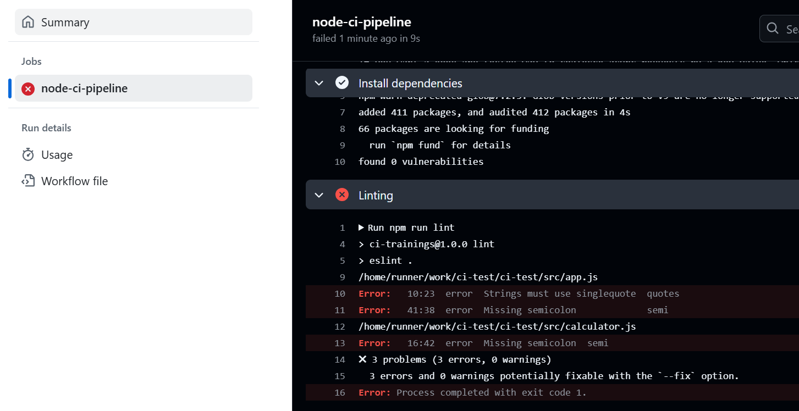
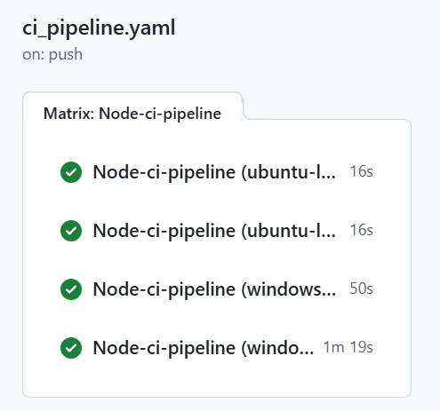

### CI workflow

In this section, we will implement simple CI workflow to lint, build and test the Node.js app. 

1. Fork the app from this [repository](https://github.com/juhahinkula/ci-training.git).

This is a Node.js Express calculator application. You can start the app using the `npm run start` command. By default, it listens on port 3000. To perform calculations, send a POST request to the `/calculate` endpoint. The request body should include the operation (add, subtract, multiply, or divide) and two numbers (`a` and `b`). The response will return the result of the calculation.

2. Clone the forked repository to your computer.

3. Install the dependencies, start the application, and verify that it functions correctly.

4. Create `./github/workflows/ci_workflow.yaml` file

Now, we are ready to write our workflow file. First we define a name of the workflow. The event that executes workflow is push to the main branch:

```yaml
# Node.js CI pipeline
name: Node.js CI

on:
  push:
    branches:
      - main
```
Next, we define jobs for our workflow. The jobs will be run on the latest version of ubuntu.
```yaml
# Node.js CI pipeline
name: Node.js CI

on:
  push:
    branches:
      - main

jobs:
  Node-ci-pipeline:
    runs-on: ubuntu-latest
```
Then we have to define steps for the `Node-ci-pipeline` job. Github provides pre-defined **actions** for specific purposes. Actions are pre-defined set of jobs or code that perform specific task. You can explore different actions in [Github marketplace](https://github.com/marketplace?type=actions).

The `checkout` action is responsible for checkout your repository so that the workflow can access its contents. The `setup-node` action is used to configure the specified version of Node.js on the runner. The `@4` indicates the version of the action being used. The `with` keyword allows you to define additional parameters, such as the Node.js version.

```yaml
# Node.js CI pipeline
name: Node.js CI

on:
  push:
    branches:
      - main

jobs:
  Node-ci-pipeline:
    runs-on: ubuntu-latest
    steps:
      - uses: actions/checkout@v4
      - uses: actions/setup-node@v4
        with: 
          node-version: '20'

```
Now, we are ready to perform linting, build, and testing. First, we will use the `npm ci` command to install dependencies in a clean environment. After the dependencies are installed, we will build the Node.js application and then execute the tests.
```yaml
# Node.js CI pipeline
name: Node.js CI

on:
  push:
    branches:
      - main

jobs:
  Node-ci-pipeline:
    runs-on: ubuntu-latest
    steps:
      - uses: actions/checkout@v4
      - uses: actions/setup-node@v4
        with: 
          node-version: '20'
      - name: Install dependencies
        run: npm ci
      - name: Linting
        run: npm run lint
      - name: Build
        run: npm run build
      - name: Run tests
        run: npm run test
```
:::note
 The `npm ci` command installs exactly what's in the `lock` file with no deviations. That guarantees the same dependencies across all environments. It requires that `lock` file exists and it removes existing `node_modules` folder before installation. It is faster than `npm install` in clean environments (CI piplines). Read more in https://docs.npmjs.com/cli/v8/commands/npm-ci
:::

Commit changes to your local repository and push changes to Github repository. If you open the **Actions** tab of your repository, you should see the workflow running.

:::info[Task: Fix errors]
The workflow may initially fail due to issues in linting or testing. 



Identify and resolve these errors to ensure the workflow completes successfully with a green status.
:::

### Matrices

In GitHub Actions, **matrices** are a feature that allows you to run multiple variations of a job in parallel. This is particularly useful for testing your code across different environments, such as multiple versions of a programming language, operating systems, or configurations.

:::info[TASK: Define matrix]
Read the [matrix documentation](https://docs.github.com/en/actions/writing-workflows/choosing-what-your-workflow-does/running-variations-of-jobs-in-a-workflow) and modify the CI workflow that we have made. The workflow should run using both the Node versions 20 and 22 and the latest ubuntu and windows versions. You should see 4 jobs executed in the workflow:



:::

---
### Further reading
- https://github.com/features/actions
- https://fullstackopen.com/en/part11/getting_started_with_git_hub_actions


MISSÄ TÄMÄ KÄSITELLÄÄN: - https://www.youtube.com/watch?v=vMhDkt5JNN0 / Secrets
