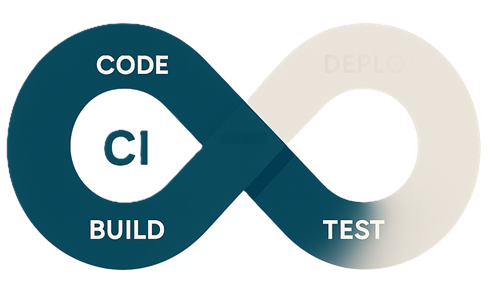

**Continuous Integration** (CI) is a DevOps practice that involves automatically integrating code changes from multiple contributors into a shared repository several times a day. This process ensures that code changes are validated through automated builds and tests, helping to identify and address issues early in the development cycle. CI aims to improve software quality, reduce integration problems, and enable faster delivery of updates to production.

In this course we are using **GitHub Actions** as a CI tool. Github Actions is integrated directly into GitHub. It allows you to automate workflows, such as building, testing, and deploying your code, whenever specific events occur in your repository (e.g., a push, pull request, or issue creation).

While GitHub Actions is a popular choice for CI, there are several other tools available that can be used for continuous integration:

- **Jenkins**: An open-source automation server that supports building, deploying, and automating software projects.
- **CircleCI**: A cloud-based CI/CD tool that integrates with GitHub and Bitbucket to automate the software development process.
- **Travis CI**: A hosted CI service that integrates with GitHub repositories to build and test software projects.
- **GitLab CI/CD**: A built-in CI/CD tool in GitLab that automates the testing, building, and deployment of applications.
- **Azure Pipelines**: A CI/CD service provided by Microsoft Azure that supports multiple languages and platforms.

