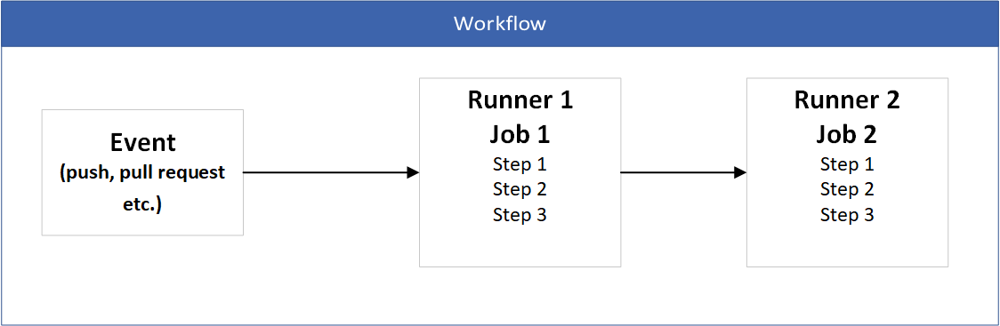

GitHub Actions is a continuous integration and continuous delivery (CI/CD) platform that allows you to automate your build, test, and deployment pipeline. You can create workflows that build and test every pull request to your repository, or deploy merged pull requests to production [Github](https://docs.github.com/en/actions/about-github-actions/understanding-github-actions#overview).

Github actions **workflow** is configurable automated process that will run one ore multiple jobs. An **event** is specific activity that triggers workflow to run. An event can be for example, push a commit to repository, create a pull request etc. Each **job** consists of **steps**, which can include actions, shell commands, or scripts. Each jobs will run inside its own virtual machine **runner** and jobs can run in sequential order or in parallel.

Github actions workflow

In the next section we will create our first github actions workflow.

---
### Further reading
- https://github.com/features/actions

