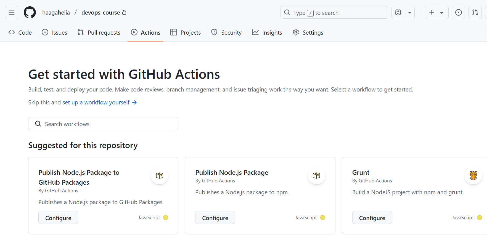

### Writing your first GitHub Actions workflow

Workflows are defined using YAML syntax (https://yaml.org/). Workflow files must have either a `.yml` or `.yaml` extension and they are save to `.github/workflows` directory in your repository. One way to create workflows is to navigate to your GitHub repository and open the Actions tab. There you can select pre-defined workflows or create your own by clicking 'set up a workflow' yourself as shown in the following image:



:::info[TASK: Create the first workflow]
Create a new repository to Github and enable *"Add a README file"* to create `README.md` file to your repository Then, follow the instructions in https://docs.github.com/en/actions/writing-workflows/quickstart#creating-your-first-workflow to create and run your first Github actions workflow.
:::

Here's an example of a workflow file similar to the one you have created in the task. Let's break down its structure to understand how it works:

```yaml
name: GitHub Actions Demo
run-name: ${{ github.actor }} is testing out GitHub Actions 🚀
on: [push]
jobs:
  Explore-GitHub-Actions:
    runs-on: ubuntu-latest
    steps:
      - run: echo "🎉 The job was automatically triggered by a ${{ github.event_name }} event."
      - run: echo "🐧 This job is now running on a ${{ runner.os }} server hosted by GitHub!"
      - run: echo "🔎 The name of your branch is ${{ github.ref }} and your repository is ${{ github.repository }}."
      - name: Check out repository code
        uses: actions/checkout@v4
      - run: echo "💡 The ${{ github.repository }} repository has been cloned to the runner."
      - run: echo "🖥️ The workflow is now ready to test your code on the runner."
      - name: List files in the repository
        run: |
          ls ${{ github.workspace }}
      - run: echo "🍏 This job's status is ${{ job.status }}."
```

The `name` defines The name of the workflow.

The `on` defines the event or events that triggers the workflow (e.g., push, pull_request, schedule). You can define multiple events that triggers the workflow in the following way `[push, pull_request]`. Read more about [events that trigger workflow](https://docs.github.com/en/actions/writing-workflows/choosing-when-your-workflow-runs/events-that-trigger-workflows) in Github docs.

You can also limit the trigger to specific branches:
```yaml
on:
  push:
    branches:
      - main
```
In this example, the workflow is configured to trigger whenever a push is made to the `main` branch of the repository. You can also use inline bracket list as shown in the following example.
```yaml
on:
  push:
    branches: [main, develop]
```

The `jobs` section specifies a set of tasks that the workflow will execute. In this example there is one job that is named `Explore-GitHub-Actions`. 

The `runs-on` defines that job runs on an `ubuntu-latest` virtual machine. You can also specify the ubuntu version for example, `runs-on: ubuntu-22.04`. Read more about choosing the runner for a job in [Github docs](https://docs.github.com/en/actions/writing-workflows/choosing-where-your-workflow-runs/choosing-the-runner-for-a-job).

The `steps` defines the individual tasks within a job. The `run` keyword is used to define a shell command or script that will be executed in a workflow step. Each `run` step executes a command directly on the runner (the virtual machine or container where the job is running).

:::note
Steps run sequentially, in order. Each step waits for the previous one to finish before starting.
:::

There are also multiline commands in `steps` such as:
```yaml
- name: List files in the repository
  run: |
    ls ${{ github.workspace }}
```
This lists all files in the repository directory on the runner using the ls command. The `${{ ... }}` syntax is used to access GitHub context variables. The `${{ github.workspace }}` returns absolute path to the GitHub workspace directory on the runner. Read more in [accessing contextual information](https://docs.github.com/en/actions/writing-workflows/choosing-what-your-workflow-does/accessing-contextual-information-about-workflow-runs)

The `|` symbol in the run section of a GitHub Actions workflow is a YAML syntax feature ***block scalar**. It is used to write multi-line strings or commands in a more readable format. You can write multiple shell commands under one run block, for example:

```yaml
- name: List files in the repository
  run: |
    echo "Listing files:"
    ls ${{ github.workspace }}
    echo "Done"
```

### Multiple jobs

By default, when your workflow contains multiple jobs, they run in parallel. In the example below, there are three jobs: `build`, `test`, and `deploy`.

The `deploy` job uses the `needs` keyword to specify that it depends on the successful completion of both the `build` and `test` jobs. This means `deploy` will only start after both of those jobs have finished successfully, ensuring that deployment happens only if the build and tests pass.

```yaml
name: Workflow with Dependencies

on: [push]

jobs:
  build:
    runs-on: ubuntu-latest
    steps:
      - run: echo "Building..."

  test:
    runs-on: ubuntu-latest
    steps:
      - run: echo "Testing..."

  deploy:
    needs: [build, test]
    runs-on: ubuntu-latest
    steps:
      - run: echo "Deploying app only after build and test succeed"
```

You can read more about `needs` syntax [here](https://docs.github.com/en/actions/writing-workflows/workflow-syntax-for-github-actions#jobsjob_idneeds).

GitHub has limits on the number of jobs that can run concurrently, which may vary based on your account type. Refer to the GitHub documentation for the  details on these [limitations](https://docs.github.com/en/actions/administering-github-actions/usage-limits-billing-and-administration).

Next, we start to implement our first CI pipeline using Github Actions.

### Further reading
- https://docs.github.com/en/actions/writing-workflows
