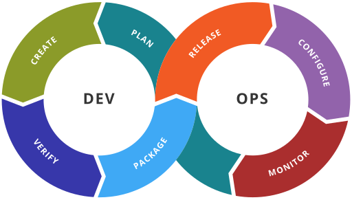

**DevOps** is a set of practices, tools, and a cultural philosophy that automates and integrates the processes between software development and IT operations teams. It emphasizes collaboration and communication to deliver software faster and more reliably.

Traditionally, development and operations teams worked in silos. Developers focused on writing code and releasing new features, while operations teams were responsible for maintaining the stability and availability of the systems. This often led to conflicts and delays.

DevOps aims to break down these silos by introducing a culture of shared responsibility. It promotes **automation**, **continuous integration**, and **continuous delivery** (CI/CD) to streamline the software development lifecycle. By using DevOps practices, organizations can achieve faster time to market, improved software quality, and increased customer satisfaction.

The following image describes the DevOps loop:

Image source: https://www.atlassian.com/devops

The DevOps loop illustrates the iterative nature of DevOps practices. It consists of the following stages:

*   **Plan:** Define and prioritize features and requirements.
*   **Build:** Integrate code changes and create software builds.
*   **Test:** Perform automated and manual testing to ensure quality.
*   **Deploy:** Deploy the software to the target environment.
*   **Operate:** Monitor and manage the software in production.
*   **Observe (Monitor):** Track performance and identify issues.
*   **Continuous feedback (Learn):** Analyze data and feedback to improve the process.

DevOps offer advantages for organizations by breaking down silos and promoting automation. DevOps can help teams deliver software faster, more reliably, and with greater efficiency. Here are some key benefits of using DevOps:

*   **Faster Time to Market:** DevOps enables organizations to release software faster by automating and streamlining the development and deployment processes.
*   **Improved Software Quality:** Continuous testing and feedback loops help identify and fix issues early in the development cycle.
*   **Increased Customer Satisfaction:** By delivering software faster and with fewer bugs, DevOps can lead to increased customer satisfaction.
*   **Better Collaboration:** DevOps promotes collaboration and communication between development and operations teams, leading to better teamwork.
*   **Greater Efficiency:** Automation and streamlined processes can help organizations reduce costs and improve efficiency.
*   **Better Reliability:** DevOps practices such as continuous monitoring and automated recovery can help ensure that systems are reliable and available.

#### CI
CI (Continuous Integration) is a practice where developers frequently integrate their code changes into a shared repository. Each integration is automatically verified by running a build and tests. This helps detect and fix issues early, improving code quality and reducing the risk of bugs in production.

#### CD
CD (Continuous Delivery) is a practice where code changes are automatically prepared for release to production. It builds on Continuous Integration by ensuring that code is always in a deployable state. With CD, every change that passes automated tests is automatically deployed to a staging environment or optionally to production. This reduces manual work and ensures that deployments are consistent and reliable.

You can read more about CI/CD in https://www.atlassian.com/continuous-delivery/principles/continuous-integration-vs-delivery-vs-deployment.

### What Does DevOps Require from a Software Developer?
DevOps requires software developers to adopt a mindset and skill set that goes beyond traditional development roles. 

Developers should be familiar with Continuous Integration and Continuous Delivery (CI/CD) practices. This includes writing code that integrates seamlessly, creating automated tests, and ensuring that builds are deployable.  Developers must work closely with operations and other teams to ensure smooth integration and delivery of software.

Developers are expected to be familiar with development automatization, such as writing scripts for build, test, and deployment processes. Developers should design applications with monitoring in mind. This includes adding logging, metrics, and tracing to help identify and resolve issues in production.

Developers should know security practices of sthe development process (DevSecOps). They should write secure code and use tools to identify vulnerabilities early. DevOps is an continuous evolving field. Developers must stay updated with the latest tools, practices, and technologies.

> *People and culture are the top factors of a successful DevOps implementation.*
> Atlassian 2020 DevOps Trends Survey (https://www.atlassian.com/whitepapers/devops-survey-2020)

### CALMS framework

CALMS is a framework that can be used to assess company's ability to adopt DevOps processes. You can read more about CALMS in https://www.atlassian.com/devops/frameworks/calms-framework.

### Tools used in each DEVOPS stage
Here are some commonly used tools in each stage of the DevOps lifecycle:

**Plan:**
  - GitHub Projects
  - Jira
  - Trello
  - Azure Boards
 
**Build:**
  - Maven
  - Gradle
  - npm
  - Docker

**Test:**
  - Selenium
  - JUnit
  - JEST
  - Playwright

**Deploy:**
  - GitHub Actions
  - Jenkins
  - CircleCI
  - Kubernetes

**Operate:**
  - Ansible
  - Chef
  - Puppet
  - Terraform

**Observe (Monitor):** / **Continuous Feedback (Learn):**
  - Prometheus
  - Grafana
  - New Relic
  - Datadog
  - BetterStack

In this course, we are mostly using tools from Github and Docker for containerization.

---
### Further Reading
- https://www.atlassian.com/devops
- https://github.com/resources/articles/devops/what-is-devops