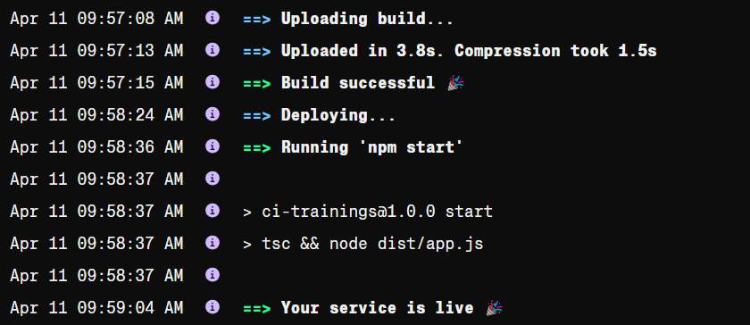
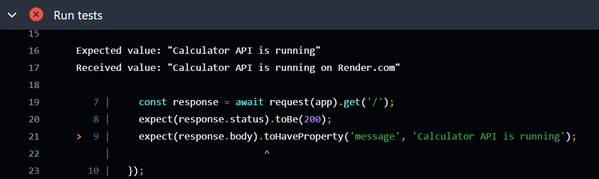
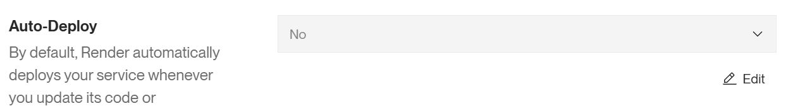
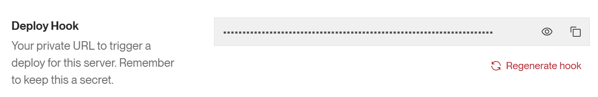
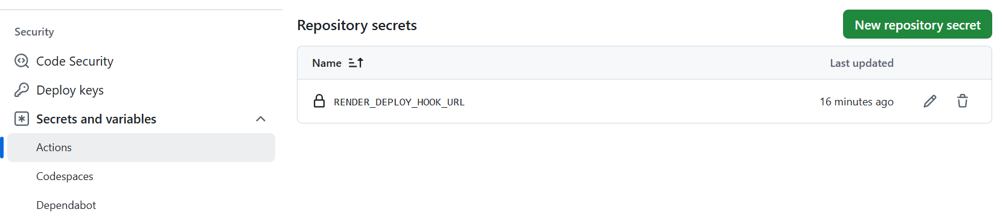

### Deployment 

We will do our first deployment to Render.com (https://render.com) that provides free Hobby plan for small-scale applications. There are some limitations in free plan that you should be aware. The deployments are much slower when using free plan and free instances will spin down with inactivity, which can delay requests by 50 seconds or more. We are going to deploy the Node Express app that we used in the CI pipelines chapter earlier. 

In this chapter, we continue working with the calculator Node.js application introduced in the CI workflow section.

First, you have to create an account to Render.com in https://dashboard.render.com/register. After you have sign-in to Render, select **New --> Web Service** in your workspace.

Next, you can select public GitHub repository where your project is hosted and press the **Connect** button (Use your own forked repository).

In the web service form, fill in the following details:

| Field           | Value        |
|------------------|--------------|
| Language         | Node         |
| Branch           | main         |
| Build command    | npm install  |
| Start command    | npm start    |

In the Instance Type select **Free** option

Finally, press the **Deploy** button. After the deployment starts, you will be redirected to a page where you can see the deployment log. Wait until, you get the message that your service is live:



As you can see the deployment to modern hosting providers is really straigthforward.

By default, Render automatically deploys your service whenever you update its code in linked GitHub repository. Opent the `app.ts` file and change the message that is displayed when you navigate to the root endpoint:

```ts
app.get('/', (req, res) => {
  res.json({ message: 'Calculator API is running on Render.com' });
});
```
Push your changes to the repository and see that the GitHub actions workflow fails. 



One of the tests does not pass, yet the application is still automatically deployed to Render.com. **Deployments should only occur after all linting and tests have successfully passed.**.

### CI/CD Pipeline

In this phase we will modify our GitHub actions workflow so that deployment is done only after linting and tests are passed. We will use web hooks to trigger deployment after linting and tests are passed. If you are not familiar with web hooks you can read more [here](https://www.redhat.com/en/topics/automation/what-is-a-webhook). The instructions to use web hooks for the deployment in Render.com can be found [here](https://render.com/docs/deploy-hooks). 

First, we will disable automatic deployment from the Render.com web service. Navigate to the settings page of your web service and select **No** from the **Auto-Deploy**.



Next, we have to get hook url. Navigate to your Render.com web service's settings and scroll down to **Deploy Hook**. Copy your private hook url and remember to keep that secret.



To securely use the deployment hook URL in your GitHub Actions workflow, you should store it as a secret. Navigate to your repository's settings, and from the left-side menu, select **Secrets and variables**. Create a new **Repository secret**, name it `RENDER_DEPLOY_HOOK_URL`, and paste the deployment hook URL you copied from Render.com into the secret value field. Finally, click the **Add Secret** button to save it.



You can read more about secrets [here](https://docs.github.com/en/actions/security-for-github-actions/security-guides/using-secrets-in-github-actions).

Now, we can  modify our Github actions workflow. Add the following Deploy step in your GitHub Actions workflow. It is responsible for triggering a deployment to the Render.com using a deployment hook URL.

```yaml
# Node.js CI/CD pipeline
name: Node.js CI/CD

on:
  push:
    branches: [main]
  pull_request:
    branches: [main]
    
jobs:
  Node-ci-pipeline:
    runs-on: ubuntu-latest
    steps:
      - uses: actions/checkout@v4
      - uses: actions/setup-node@v4
        with: 
          node-version: '20'
      - name: Install dependencies
        run: npm ci
      - name: Linting
        run: npm run lint
      - name: Run tests
        run: npm run test
      - name: Build
        run: npm run build
      //highlight-start
      # Deployment to Render.com
      - name: Deploy
        env:
          deploy_url: ${{ secrets.RENDER_DEPLOY_HOOK_URL }}
        run: |
          curl "$deploy_url"   
     //highlight-end
```
- The `deploy_url` is set using a secret stored in your GitHub repository (`RENDER_DEPLOY_HOOK_URL`).
Secrets are securely stored and not exposed in logs, ensuring sensitive information like deployment URLs or API keys remains protected.
- The `curl` command is used to make an HTTP request to the deployment hook URL (`$deploy_url`).
This triggers a deployment process on a Render, which listens for such hooks to start deploying the latest version of your application.

Once the deployment is triggered, navigate to the **Events** section in your Render.com web service dashboard. Here, you should see a new deployment event. After the deployment completes, the latest version of your application will be live.

:::note
In the previous example, deployment is triggered for both pushes and pull requests. However, we only want to deploy when code is pushed directly to the `main` branch. To achieve this, you can use the `if` condition to ensure deployment runs only on pushes to `main`.

We also use `needs` to specify that the `deploy` job should only run after the `ci` job has completed successfully. This ensures that deployment only happens if all previous steps—such as linting, building, and testing—have passed.
:::

```yaml
name: Node.js CI/CD

on:
  push:
    branches: [main]
  pull_request:
    branches: [main]
    
jobs:
  ci:
    runs-on: ubuntu-latest
    steps:
      - uses: actions/checkout@v4
      - uses: actions/setup-node@v4
        with: 
          node-version: '20'
      - name: Install dependencies
        run: npm ci
      - name: Linting
        run: npm run lint
      - name: Run tests
        run: npm test
      - name: Build
        run: npm run build
  
  //highlight-start
  deploy:
    if: github.event_name == 'push' && github.ref == 'refs/heads/main'
    needs: ci
    runs-on: ubuntu-latest
    steps:
      - name: Deploy to Render
        env:
          DEPLOY_URL: ${{ secrets.RENDER_DEPLOY_HOOK_URL }}
        run: curl -X POST "$DEPLOY_URL"
  //highlight-end
```

A common practice is that linters and tests are often run in the same workflow, but deployment is kept in a separate workflow. This way you get a clean separation, where one workflow handles lint/tests and another handles deployment only after the first one is green.

In our case workflows could be the following:

```yaml title="CI workflow"
name: CI

on:
  push:
    branches: [main]
  pull_request:
    branches: [main]
    
jobs:
  Node-ci-pipeline:
    runs-on: ubuntu-latest
    steps:
      - uses: actions/checkout@v4
      - uses: actions/setup-node@v4
        with: 
          node-version: '20'
      - name: Install dependencies
        run: npm ci
      - name: Linting
        run: npm run lint
      - name: Run tests
        run: npm run test
      - name: Build
        run: npm run build        
```
We want to make sure that the deploy runs only if the CI has passed. We can use the `workflow_run` trigger in the deployment workflow.

```yaml title="CD workflow"
name: CD

on:
  workflow_run:
    workflows: ["CI"]
    types:
      - completed
    
jobs:
  deploy:
    if: github.event_name == 'push' && github.ref == 'refs/heads/main'
    runs-on: ubuntu-latest
    steps:
      - name: Deploy
        env:
          deploy_url: ${{ secrets.RENDER_DEPLOY_HOOK_URL }}
        run: |
          curl "$deploy_url"   
```

There is also `workflow_dispatch` to manually trigger deploy after verifying CI. That gives complete control over when to deploy but it requires manual action.

---
### Further reading
- https://docs.github.com/en/actions/about-github-actions/about-continuous-deployment-with-github-actions 

