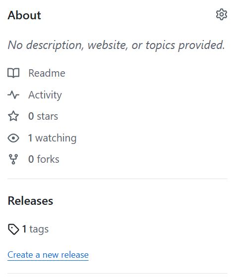
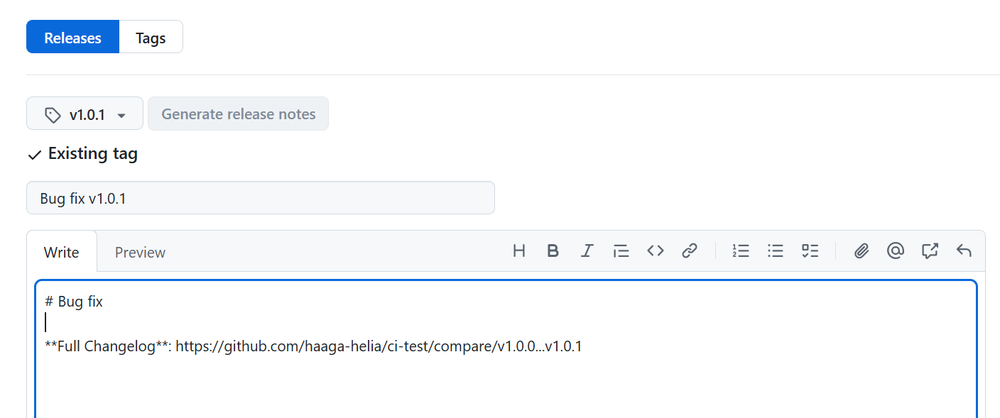

### Creating tags
Git supports **tags**, which are commonly used to mark specific points in a project's history, such as release versions.  When you create a tag in Git, it points to a specific commit in the repository's history. This means the tag represents the state of the entire repository (all files and directories) at the time of that commit. There are two types of tags: **lightweight** and **annotated**. Annotated tags include metadata about the release and are the preferred choice.

To create a new annotated tag, use the following command:
```bash
git tag -a tag_name -m "comment"
```
, where `-m` specifies a tag message.

Tag names typically follow semantic versioning and often start with a `v`. For example:
```bash
git tag -a v1.0.0 -m "First production release"
```
You can list all tags using the following command:
```bash
git tag
```
Let's use our example Node.js express project that we have used to create CI/CD pipeline. Create a new tag using the following command in terminal:
```bash
git tag -a v1.0.0 -m "First production release"
```
If you created a tag in your local repository but it hasn't been pushed to GitHub, you need to explicitly push the tag to the remote repository. By default, git push does not automatically push tags unless specified. Push tag to the Github repository by using the following command:
```bash
git push origin v1.0.0
```
Now, if you navigate to your Github repository, you should see the tag in your repository unde the Releases.



You can also create tags directly from the Github use interface.

### Automate with CI/CD pipelines using tags.
Now, in this case, we want to deploy our project only when a new release is created (a tag is added). Open the `ci_pipeline.yaml` file. As you remember, the `on` section defines the events that trigger the workflow. To ensure the workflow runs when new tags are added, include the `tags` configuration under the `on` section.

```yaml
name: Node.js CI/CD

on:
  push:
    branches: [main]
    //highlight-start
    tags: ['*']
    //highlight-end
  pull_request:
    branches: [main]
```
Then we can used `if` to execute deployment job only if a new tag is added.
```yaml
# Only run this step if a tag is pushed
if: startsWith(github.ref, 'refs/tags/')
  env:
    deploy_url: ${{ secrets.RENDER_DEPLOY_HOOK_URL }}
  run: |
    curl "$deploy_url"
```
The `github.ref` is built-in GitHub Actions context variable. It represents the Git reference (e.g., branch or tag) that triggered the workflow. Now, in our case the `github.ref` is `refs/tags/v1.0.0`. If a branch is pushed, `github.ref` might be `refs/heads/main`.

You can read more about `if` statement syntax [here](https://docs.github.com/en/actions/writing-workflows/workflow-syntax-for-github-actions#jobsjob_idif).
 
Now, if you make some code changes, the workflow will run linting and tests but it doesn't deploy our app. When you add a new tag then app is also deployed. 

### Github releases

You can create a release in GitHub from an existing tag. To do this, go to the main page of your repository and click the **Create a new release** link. From the `Choose a tag` dropdown, select the desired tag. Add a title and release notes, then click the **Publish release** button when you're ready.



GitHub will automatically include links to download a zip file and a tarball containing the contents of the repository at the point of the tag's creation.

A GitHub Release is based on a Git tag but provides extra metadata like release notes, attached binaries/artifacts, and changelogs. It’s more user-friendly and meant for distributing packaged versions of software.

You can also run a GitHub workflow when new release is published using the following syntax:
```yaml
on:
  release:
    types: [published]
```

---
### Further reading
- https://git-scm.com/book/en/v2/Git-Basics-Tagging
- https://docs.github.com/en/repositories/releasing-projects-on-github/about-releases
