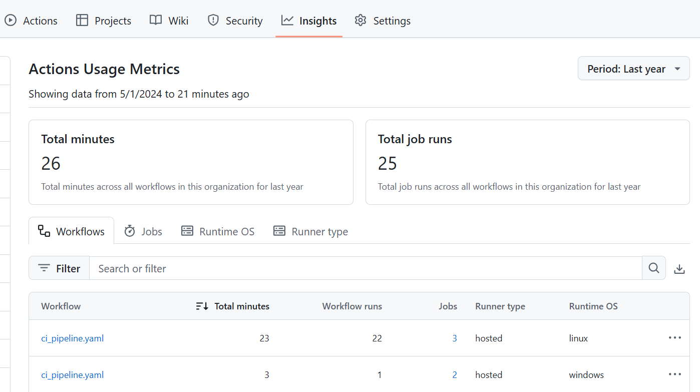
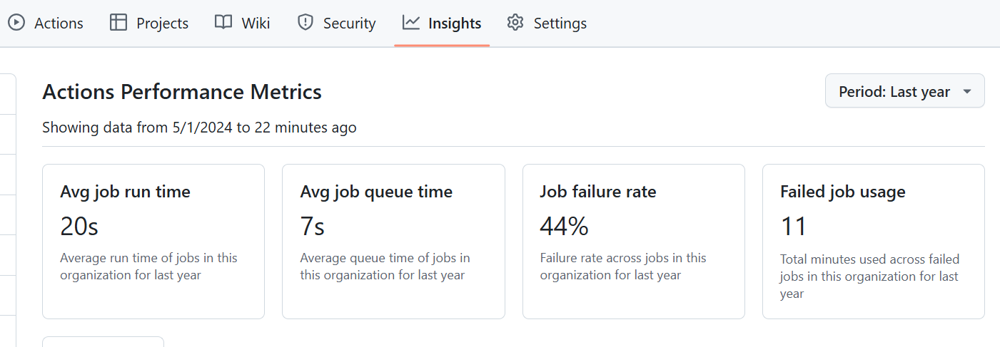

Github provides tools to monitor workflows in Github Actions. You have already seen the visualization graph that illustrates the workflow run progress. 

From the **Insights** tab in your repository, you can view two categories of metrics:

**Actions Usage Metrics** 

GitHub Actions usage metrics provides information on how your organization is using Actions minutes.

**Actions Performance Metrics** 

GitHub Actions performance metrics enables you to analyze the efficiency and reliability of your workflows.

---
### Further reading
- https://docs.github.com/en/actions/monitoring-and-troubleshooting-workflows/monitoring-workflows
