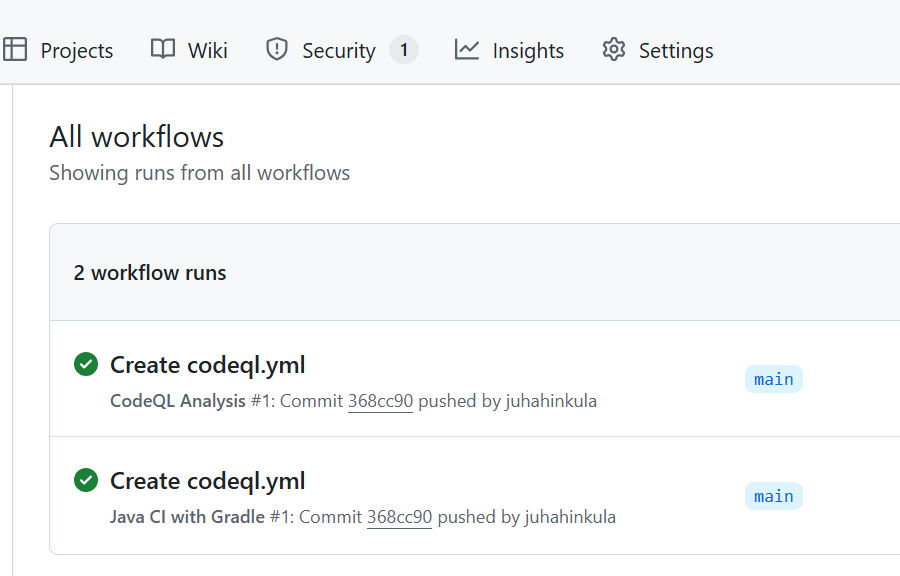
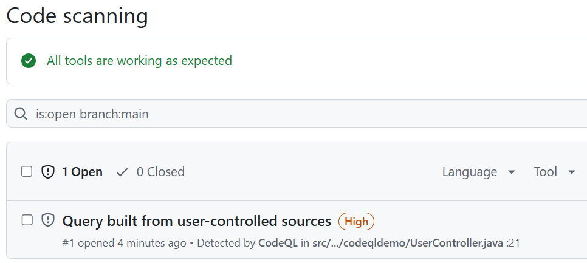

**DevSecOps** is the practice of integrating security into every stage of the software development lifecycle, combining development (Dev), security (Sec), and operations (Ops). It emphasizes collaboration between development, security, and operations teams to identify and address security issues early and continuously.

**Practical examples of DevSecOps:**

**Automated Security Testing:** Integrating tools like CodeQL or SonarQube into CI/CD pipelines to automatically scan code for vulnerabilities.

**Container Security:** Using tools such as Trivy or Aqua Security to scan container images for known vulnerabilities before deployment.

**Infrastructure as Code (IaC) Scanning:** Employing tools like Checkov or Terraform Compliance to ensure infrastructure code follows security best practices.

**Secrets Management:** Implementing solutions like HashiCorp Vault or Azure Key Vault to securely manage sensitive information such as API keys and passwords.

### Automated security testing

Automated security testing in software development is the practice of using tools and scripts to automatically scan code and dependencies for security vulnerabilities throughout the development lifecycle. This process helps identify issues such as insecure code patterns, known vulnerabilities in libraries, misconfigurations, and secrets exposure before software is deployed.

#### CodeQL

CodeQL is a code analysis engine developed by GitHub. It's used to automatically find security vulnerabilities and bugs in source code by treating code as data and querying it like a database. CodeQL lets you write queries in a declarative language (similar to SQL) to examine the relationships and flow in your codebase.

You can run CodeQL from the command line ([CodeQL CLI](https://docs.github.com/en/code-security/codeql-cli/getting-started-with-the-codeql-cli/about-the-codeql-cli)) or integrate with Visual Studio Code using the [CodeQL extension](https://marketplace.visualstudio.com/items?itemName=github.vscode-codeql).

#### Example

In this course, we learn how to integrate CodeQL to your Github workflows. Clone the following Java project [repository](https://github.com/juhahinkula/codeql-demo.git).

The project is a basic user management system built with Spring Boot and Gradle. Our goal is to set up a CodeQL analysis workflow that runs automatically whenever code is pushed to the main branch. You don't need to build Java projects to run CodeQL analysis. You can Read more about that in [code scanning for compiled languages](https://docs.github.com/en/code-security/code-scanning/creating-an-advanced-setup-for-code-scanning/codeql-code-scanning-for-compiled-languages).

To begin, create a new workflow file named `codeql.yml` in the `.github\workflows` directory. Specify a descriptive name for the workflow and configure the events that will trigger its execution:

```yaml
name: "CodeQL Analysis"

on:
  push:
    branches: [ "main" ]
  pull_request:
    branches: [ "main" ]
```
Next, add a first job that runs on the latest Ubuntu virtual environment. 

We have to define permissions in the following way:
`actions: read` – Allows the job to read actions in the repository.
`contents: read` – Allows the job to read repository contents.
`security-events: write` – Allows the job to upload security analysis results (such as CodeQL findings) to GitHub’s Security tab.

```yaml
jobs:
  analyze:
    name: Analyze (${{ matrix.language }})
    runs-on: ubuntu-latest
    permissions:
      actions: read
      contents: read
      security-events: write
```

The `strategy` defines how jobs are run. The `fail-fast: false` define that jobs will run to completion even if one fails. The `matrix` contains one variable, `language`, set to `['java-kotlin']`. If you add more languages (e.g., ['java', 'node']), the job would run once for each language.

```yaml
    strategy:
      fail-fast: false
      matrix:
        # Analyzes Java code directly from the codebase without a build
        language: [ 'java-kotlin' ]  
```
The first step checks out your repository’s code onto the runner. It makes your code available for the next steps in the workflow.

```yaml
steps:
    - name: Checkout repository
      uses: actions/checkout@v4
```
The last steps handles the CodeQL analysis.

`Initialize CodeQL` step sets up CodeQL for the workflow. It specifies which programming languages to analyze (using `${{ matrix.language }}` so it can run for multiple languages if needed).

`Perform CodeQL Analysis` step runs the actual CodeQL analysis. It scans your codebase for security issues and vulnerabilities. The `category` property helps organize the results by language.


```yaml
    - name: Initialize CodeQL
      uses: github/codeql-action/init@v3
      with:
        languages: ${{ matrix.language }}

    - name: Perform CodeQL Analysis
      uses: github/codeql-action/analyze@v3
      with:
        category: "/language:${{matrix.language}}"
```

Finally, the whole workflow looks the following:

```yaml
name: "CodeQL Analysis"

on:
  push:
    branches: [ "main" ]
  pull_request:
    branches: [ "main" ]

jobs:
  analyze:
    name: Analyze (${{ matrix.language }})
    runs-on: ubuntu-latest
    permissions:
      actions: read
      contents: read
      security-events: write

    strategy:
      fail-fast: false
      matrix:
        language: [ 'java-kotlin' ]
        # This mode only analyzes Java. Set this to 'autobuild' if Kotlin
        build-mode: none 

    steps:
    - name: Checkout repository
      uses: actions/checkout@v4

    - name: Initialize CodeQL
      uses: github/codeql-action/init@v3
      with:
        languages: ${{ matrix.language }}

    - name: Perform CodeQL Analysis
      uses: github/codeql-action/analyze@v3
      with:
        category: "/language:${{matrix.language}}"
```
The workflow is now set up. After its first successful run, you should see a security issue detected in the Security tab, as shwon in the image below.



Navigate to the Security tab, select "Code scanning" from the left menu, and you should see the security alert listed there.



When you open the security alert, you'll find detailed information about the identified issue. To fix it, you can create a new branch and begin working on a fix. Additionally, you can use Copilot to help automatically resolve the issue.

You can also write your own custom CodeQL queries and you can read more about CodeQL syntax in https://codeql.github.com/docs/codeql-overview/.

### GitHub Dependabot

GitHub Dependabot is a built-in tool in GitHub that helps you keep your dependencies up to date and secure. It automatically checks your project’s dependencies for outdated or insecure libraries. When it finds a new version or a security vulnerability, Dependabot can automatically create pull requests to update the affected dependencies.

To get practical experience with GitHub Dependabot, it is recommended that you follow the official [Dependabot quickstart tutorial](https://docs.github.com/en/code-security/getting-started/dependabot-quickstart-guide).

:::info[TASK: OWASP WebGoat]

OWASP [WebGoat](https://owasp.org/www-project-webgoat/) is an intentionally insecure web application created by the Open Web Application Security Project (OWASP) for educational purposes. 

Fork WebGoat repository from https://github.com/WebGoat/WebGoat/wiki/Forking-WebGoat-in-GitHub

After cloning the repository, you can start WebGoat using Docker:

```
docker run -it -p 127.0.0.1:8080:8080 -p 127.0.0.1:9090:9090 webgoat/webgoat
```

Once the container is running, open your browser and navigate to `localhost:8080/WebGoat` to access the WebGoat application.

Next, create a GitHub Actions workflow to your WebGoat repository to run CodeQL analysis on the WebGoat Java source code. WebGoat is intentionally vulnerable, so CodeQL will detect many issues.

:::

---
### Further Reading
- http://codeql.github.com/
- https://www.microsoft.com/en-in/security/business/security-101/what-is-devsecops
- https://www.redhat.com/en/topics/devops/what-is-devsecops